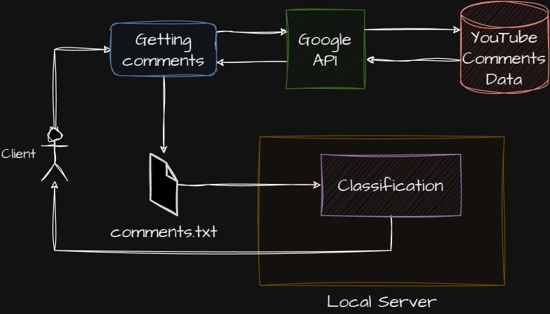
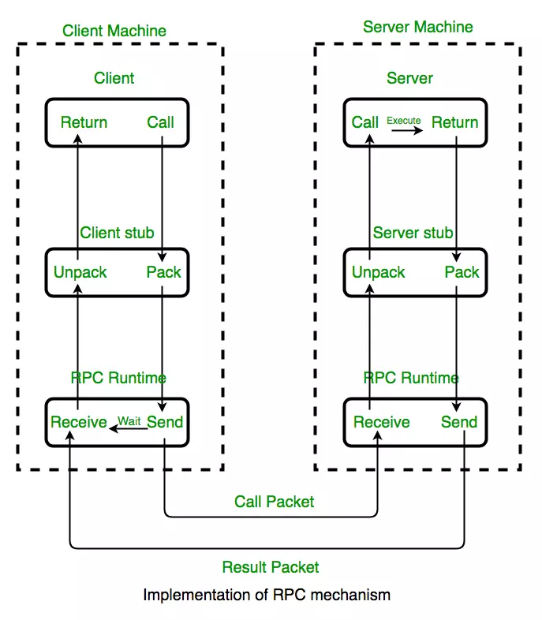
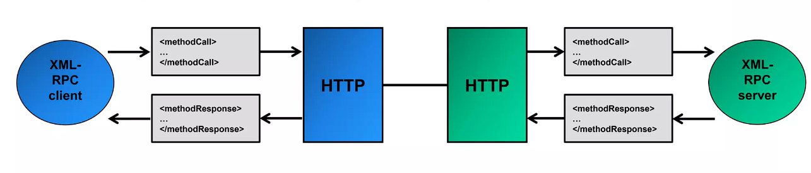
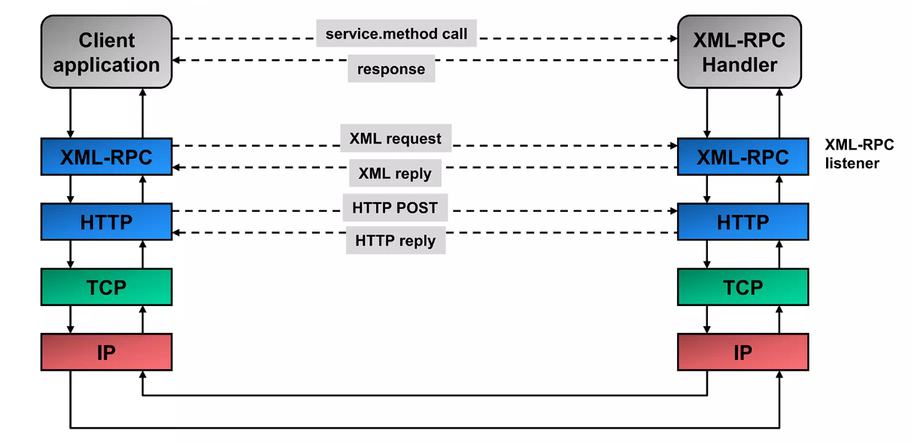

# Topic: Simple map-reduce system based on RPC : COMMENT CLASSIFICATION

## I/ Introduction

<h2 align='center'>Abstraction</h2>
Our project is Youtube Comments Filtering using Simple Map-Reduce system based on RPC: <br>
- We run a server with simple Map-Reduce system that will filter positive, negative and neutral comments.<br>
- Lastly, we use a Client python code to read the txt file and return the filtered result.

## II/ Design Architecture

<p>This mini project is built in 2 part: Collecting & Pre-processing data AND Apply Simple map-reduce system based on RPC</p>



<p>We collect comment from youtube video through YouTube videos' ID and API provided by Google. After that, we pre-process the data by some filters to make the data more clean and smooth.</p>
<p>After the file: "comment.txt" is generated, the Client application access to server through a URL and request service or method with "comment.txt" file as input. </p>
<p>The server will apply map-reduce, handle the input and classify comment into 3 group "positive", "negative" and "neutral" and sends back result for Client.</p>





## III/ Installation and Run

### A. Installation

1. Supported Python Versions: Python 3.7, 3.8, 3.9, 3.10, 3.11 and 3.12
2. Download all these file in this respiratory
3. Download all library that required:

- Google API Client: <br>
  Install this library in a virtualenv using pip. virtualenv is a tool to create isolated Python environments. The basic problem it addresses is one of dependencies and versions, and indirectly permissions.
  With virtualenv, it's possible to install this library without needing system install permissions, and without clashing with the installed system dependencies.

```python
pip install virtualenv
virtualenv <your-env>
<your-env>\Scripts\activate
<your-env>\Scripts\pip.exe install google-api-python-client
#below is optional
<your-env>\Scripts\pip install google-auth google-auth-oauthlib google-auth-httplib2
```

If any addition required please look through this <a href ='https://github.com/googleapis/google-api-python-client?tab=readme-ov-file'> Addition</a>

- xmlrpc — XMLRPC server and client modules: <br>
  This may already installed in your computer. But if you do not have this lib, you can install it.

```python
pip install pypi-xmlrpc
```

### B. Run

1. Get the youtube video's id you want to collect comments, replace parameter "VIDEO_ID" in file "ReadComments.py" and compile it, file "comments.txt" will be generated automatically for you.

```python
VIDEO_ID = ""
```

2. Activate server: Run file "ServerComments.py" in a terminal. You can also replace port 8000 to any port you prefer. You will see this:

```
Listening on port 8000...
```

3. Run "ClientComments.py" on another terminal. The expected outcome is number of the comments in each group we classified.

```terminal
[{'positive': 1, 'negative': 0, 'neutral': 2}]
```

## IV/ Applied Scenario

Every opinion and also video on youtube are having 2 sides. People also have different perspective on the same thing. We often comment on something to express our thought, feelings and we are tend to find people who has the same thinking with them. So our project is providing it for user to have the overview of the crowd that commented on that video.

1. Find food review video for traveling: <br>
   You find a food review "The best dish you need to try when come to Paris". You can use this system to check and compare the rate of people who are agreed with that video and who did not.

2. Go through a video with offensive opinion: <br>
   You can check the attitude of people about that opinion. If you feel it was right then see how much people encourage that thinking like you. Or you maybe start thinking about: Are you a weirdo?

### Contributors: GROUP 19

| Name                | School ID |
| ------------------- | --------- |
| Nguyễn Trần Đức Quý | BI12-376  |
| Trần Đức Anh        | BI12-018  |
| Hứa Hải Minh        | BI12-272  |
| Phùng Đức Thái      | BI12-396  |
| Bùi Minh Quang      | BI12-373  |
| Chu Minh Quân       | BI12-366  |

### References

<a href='https://docs.python.org/3/library/xmlrpc.client.html?fbclid=IwZXh0bgNhZW0CMTAAAR0UAz4tJusXdEsVrXpPJiXh4lpBBEeY8ejY02gSnh_mGzue1_r7-xBrMn4_aem_AdMNXrKFoi4BXLfMHjnsGkgsVNdywttanoB-1ZjdWe0jUPkRWHZZl1EH8Sy1srcCa_EYQzSq5XHcr17AdiMv-NAF'>Python xml-rpc library</a><br>
<a href ='https://www.slideshare.net/PeterREgli/xmlrpc-9277900'>XML-RPC architecture</a>
